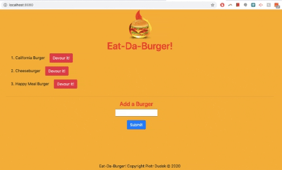
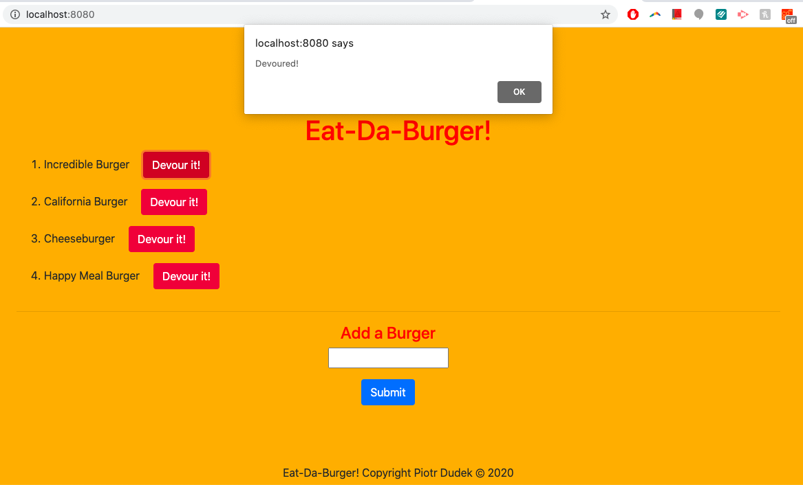
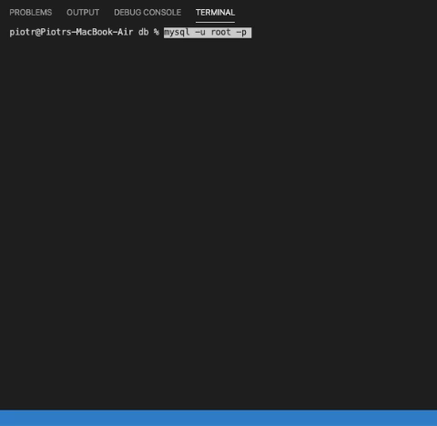
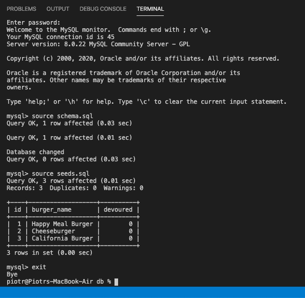

# Eat-Da-Burger! - a burger app :hamburger: :fries: :beer:

## Description
Welcome to my burger app! This app utilizes node.js, handlebars, my own orm, express routes, and SQL database in order to create and display new burgers for a restaurant menu. The status of the burger can be changed with one click from "ordered" to "devoured" and then the burger will be then displayed on the right side of the screen. Have fun using the app!

## Table of Contents
* [Installation](#Installation)
* [Usage](#Usage)
* [License](#License)
* [Contributing](#Contributing)
* [Test](#Test)
* [Questions](#Questions)

## Installation

You can use this app by clicking the link to the version deployed with Heroku or you can download it from my GitHub repository, open in VS Code or another relevant app, and type in your terminal `npm i` to install dependencies and then type `node server.js`. Click the link to the localhost server that will be displayed in the terminal in order to access the app.

## Usage
You can see burgers ready to be devoured on the left side. After clicking the "Devour it!" button located next to each burger, the burger will be displayed on the right side of the screen. You can always create a new burger using the text area on the bottom of the page and clicking the "Submit" button. Enjoy!

## License
This application is covered under the MIT license.

## Contributing
If you would like to contribute to this project, please let me know.

## Test
Testing framework used: N/A

## Questions
If you have additional questions, you can reach me via my GitHub profile: [peterdudek](https://github.com/peterdudek) 
or send me an email at: piotr72@gmail.com
